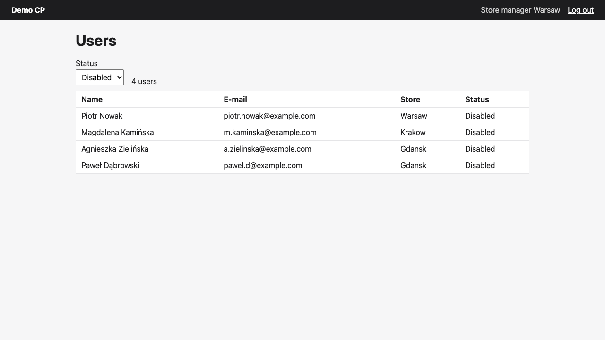
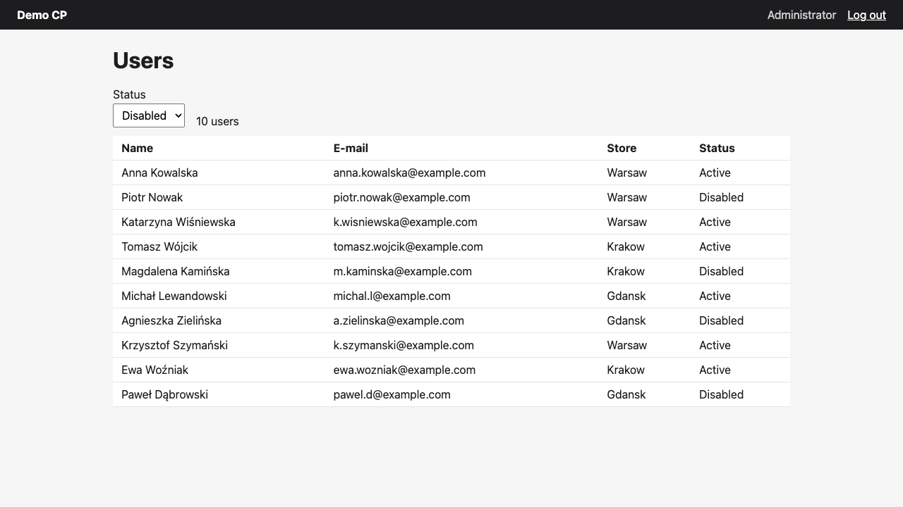
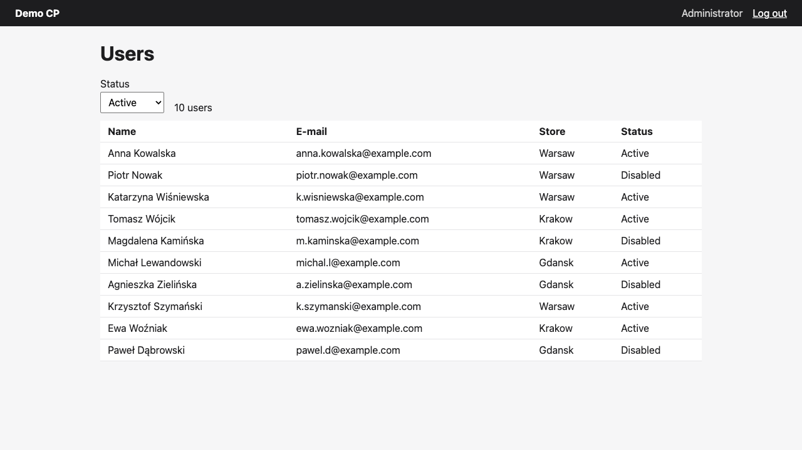
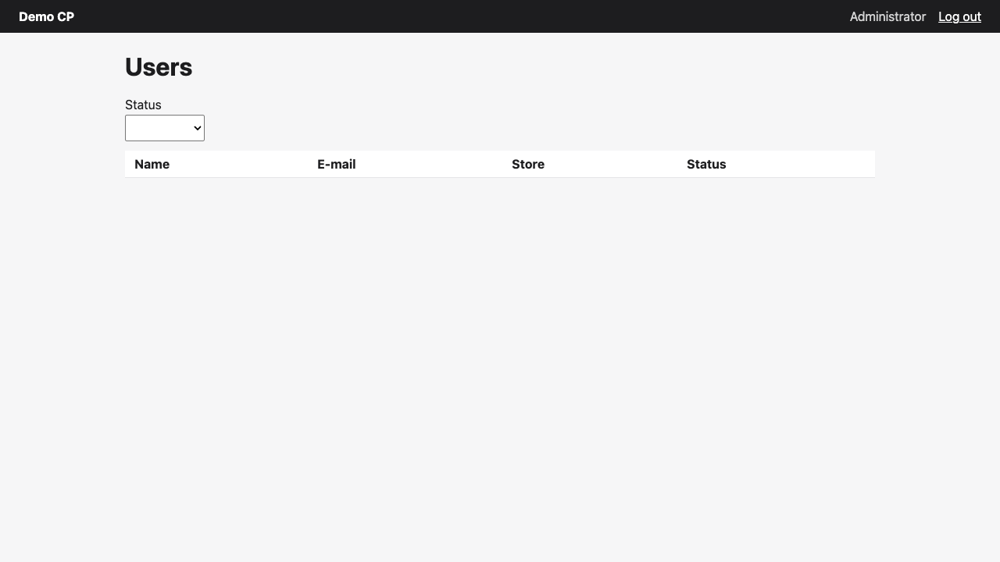
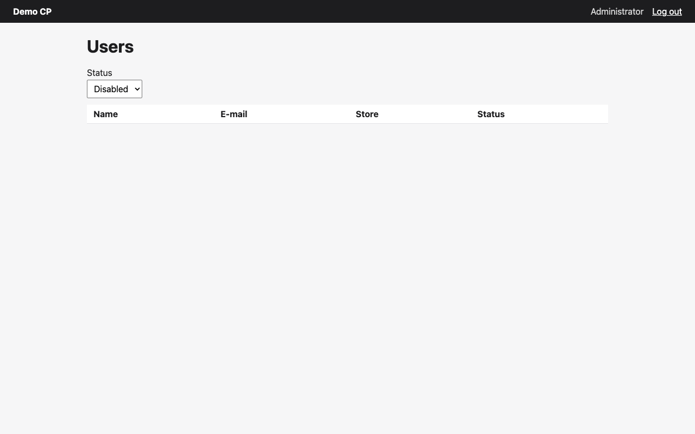
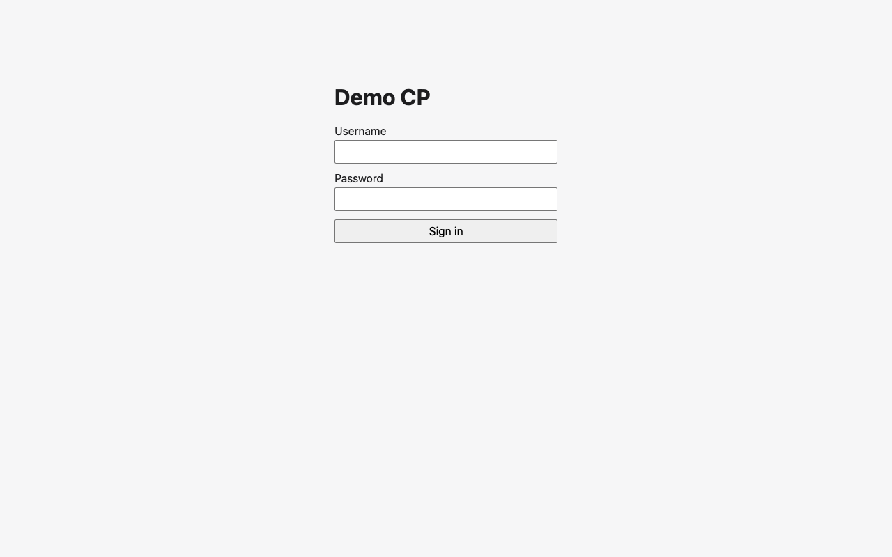
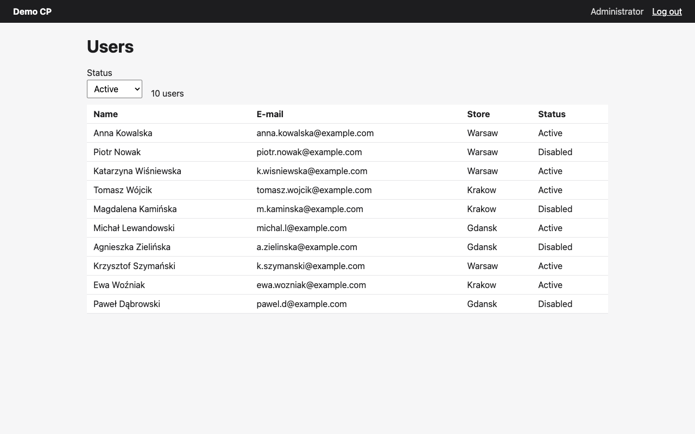
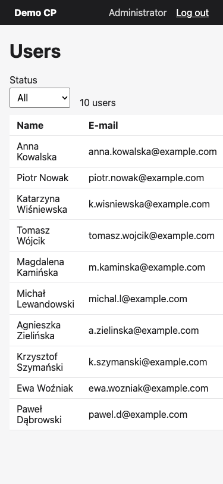

> **Example report** generated by qa-loop on the bundled [demo app](../examples/demo-app/README.md) (`/qa-loop:test examples/demo-app/tickets/DEMO-1.md --quick`, 4 cases, 11 minutes). Screenshots are included; traces, DOM snapshots and logs stay in the local run directory and are shown here as file names.

# QA DEMO-1 — ❌ REJECTED

**[Users][FE] Status filter on the users list**

Failed acceptance criteria: AC-4; Blocking bugs: F-1, F-2

Findings: 1 critical · 1 high · 3 medium · 1 question

**Fix first:**

1. F-1 (critical) — GET /api/users?status=disabled returns disabled users of other stores to the Warsaw store manager (cause of AC-4 FAIL) [AC-4]
2. F-2 (high) — A slow 'All' response overwrites the newer filter: select shows Disabled, table shows all users (cause of EX-1 FAIL) [EX-1]

| | |
|---|---|
| Environment | http://localhost:4317 |
| Date | 2026-10-07T14:36:07.873Z · 11 min |
| Mode | quick · roles: admin, manager |
| Code | — |

## Acceptance criteria

| # | Criterion | Result | Evidence / notes |
|---|---|---|---|
| AC-2 | "Disabled" shows only disabled users | ✅ PASS | Status column of all 4 rows = 'Disabled' (eval on table tbody), and the 4 names equal the 4 Disabled rows of the All view (10 rows); counte… [01-all-loaded.png](example/screenshots/AC-2-01-all-loaded.png) [02-disabled-selected.png](example/screenshots/AC-2-02-disabled-selected.png) |
| AC-4 | A store manager sees only their store with every filter | ❌ FAIL | All: 4 rows, all Store = Warsaw, counter '4 users'. Active: 3 rows, all Store = Warsaw, counter '3 users'. Disabled (URL /users?status=disa… [01-all.png](example/screenshots/AC-4-01-all.png) [02-active.png](example/screenshots/AC-4-02-active.png) |

## What is wrong and open questions

### AC-4 · ❌ FAIL — A store manager sees only their store with every filter
- **Steps:** 1. Log in as 'Store manager Warsaw' (saved state) and open http://localhost:4317/users?status=all 2. Select Status = Disabled in the 'Status' combobox 3. Read the Store column of the table
- **Expected:** For every filter all rows have Store = Warsaw
- **Actual:** All: 4 rows, all Store = Warsaw, counter '4 users'. Active: 3 rows, all Store = Warsaw, counter '3 users'. Disabled (URL /users?status=disabled): 4 rows, counter '4 users': Piotr Nowak (Warsaw), Magdalena Kamińska (Krakow), Agnieszka Zielińska (Gdansk), Paweł Dąbrowski (Gdansk). GET /api/users?status=disabled in the manager session returned 200 with the same 4 users including the Krakow and Gdansk ones (names and e-mail addresses). Same result after a reload of /users?status=disabled and in repro.js. Probes: no status, status=all, status= and status=active return only Warsaw users; status=disabled&store=Warsaw still returns the other stores; invalid values (DISABLED, Disabled, foo) return 400 (the 3 console errors and failed requests in this case's signals are these deliberate probes).
- **Hypothesis (unverified):** The API applies the store scope of the logged-in manager for status=all and status=active but skips it for status=disabled (unverified).
- **Reproduced:** 2×
- **Automated reproduction:** `repro.js`
- **Evidence:** [01-all.png](example/screenshots/AC-4-01-all.png) · [02-active.png](example/screenshots/AC-4-02-active.png) · [03-disabled.png](example/screenshots/AC-4-03-disabled.png) · [04-disabled-after-reload-replay.png](example/screenshots/AC-4-04-disabled-after-reload-replay.png) · `trace.zip`




### F-1 · ❌ BUG (critical) [security] — GET /api/users?status=disabled returns disabled users of other stores to the Warsaw store manager (cause of AC-4 FAIL)
- **Steps:** 1. Log in as 'Store manager Warsaw' 2. Open http://localhost:4317/users?status=all and select Status = Disabled (or call GET /api/users?status=disabled in that session)
- **Expected:** Only disabled users of store Warsaw (in the seeded data: Piotr Nowak); users of Krakow and Gdansk are never returned to this manager
- **Actual:** The table and the API response (200) contain 3 users from other stores with name and e-mail: Magdalena Kamińska (Krakow, m.kaminska@example.com), Agnieszka Zielińska (Gdansk, a.zielinska@example.com), Paweł Dąbrowski (Gdansk, pawel.d@example.com). Adding &store=Warsaw does not narrow it. status=all and status=active are correctly limited to Warsaw.
- **Hypothesis (unverified):** The store scope is not applied on the status=disabled branch of the API (unverified).
- **Reproduced:** 2× · **Related to the change:** yes
- **Automated reproduction:** `repro.js`
- **Evidence:** [03-disabled.png](example/screenshots/AC-4-03-disabled.png) · [04-disabled-after-reload-replay.png](example/screenshots/AC-4-04-disabled-after-reload-replay.png) · `trace.zip` · `api-01.json` · `network.txt`


### F-2 · ❌ BUG (high) [functional] — A slow 'All' response overwrites the newer filter: select shows Disabled, table shows all users (cause of EX-1 FAIL)
- **Steps:** 1. As Administrator open http://localhost:4317/users?status=all 2. Within ~0.7 s (before the list loads) select Status = Disabled 3. Wait 2 s
- **Expected:** Only the 4 disabled users, counter '4 users'
- **Actual:** Select 'Disabled', URL ?status=disabled, counter '10 users', table with all 10 users including 6 Active. GET /api/users?status=all takes ~0.9 s vs ~0.16 s for the other filters, so its response arrives last and is rendered. Also happens mid-session when switching to All and then to another filter within ~0.7 s.
- **Hypothesis (unverified):** Responses of superseded requests are not ignored or aborted (unverified).
- **Reproduced:** 2× · **Related to the change:** yes
- **Automated reproduction:** `repro.js`
- **Evidence:** [01-stale-all-overwrites-disabled.png](example/screenshots/EX-1-01-stale-all-overwrites-disabled.png) · [02-stale-all-overwrites-active-midsession.png](example/screenshots/EX-1-02-stale-all-overwrites-active-midsession.png) · `trace.zip` · `network.txt`




### F-3 · ❌ BUG (medium) [functional] — A link with an invalid ?status value shows an empty table with no message and throws an uncaught TypeError
- **Steps:** 1. As Administrator open http://localhost:4317/users?status=xyz (the API also rejects 'Disabled' and 'DISABLED' with 400)
- **Expected:** A clear message or a fallback to a valid filter (the ticket makes ?status= a linkable state)
- **Actual:** GET /api/users?status=xyz returns 400; the page shows a blank Status select, no counter, an empty table and no message. Uncaught page error: "TypeError: Cannot read properties of undefined (reading 'map') at render (http://localhost:4317/app.js:10:6)". Selecting a filter in the select recovers the list.
- **Hypothesis (unverified):** render() expects a users array and does not handle error responses; likely the same cause as F-5 and F-6 (unverified).
- **Reproduced:** 2× · **Related to the change:** yes
- **Evidence:** [03-invalid-status-link.png](example/screenshots/EX-1-03-invalid-status-link.png) · `trace.zip` · `console.txt`



### F-5 · ❌ BUG (medium) [functional] — When /api/users fails (500) the old list stays under the new filter with no message, and an uncaught TypeError is thrown
- **Steps:** 1. As Administrator open http://localhost:4317/users?status=all and wait for 10 users 2. Make GET /api/users* return 500 (mock) 3. Select Status = Disabled
- **Expected:** A clear error message, no uncaught exception, and the All list is not presented as the Disabled result
- **Actual:** Select 'Disabled', URL ?status=disabled, table still shows all 10 users (6 Active), counter '10 users', no message; uncaught "TypeError: Cannot read properties of undefined (reading 'map')". On initial load with 500 the table is empty, no counter, no message, same TypeError. Offline (seen once): same stale list, uncaught 'TypeError: Failed to fetch'.
- **Hypothesis (unverified):** No error handling around the list fetch; same TypeError as F-3 and F-6 (unverified).
- **Reproduced:** 2× · **Related to the change:** yes
- **Automated reproduction:** `repro.js`
- **Evidence:** [01-500-on-filter-change.png](example/screenshots/EX-2-01-500-on-filter-change.png) · [02-500-on-initial-load.png](example/screenshots/EX-2-02-500-on-initial-load.png) · [06-offline-filter-change.png](example/screenshots/EX-2-06-offline-filter-change.png) · `trace.zip` · `console.txt`




### F-6 · ❌ BUG (medium) [functional] — Expired session: a filter change gets 401 but the page neither redirects to sign-in nor shows a message; the old list stays
- **Steps:** 1. As Administrator open http://localhost:4317/users?status=all and wait for 10 users 2. End the session in the own browser context (cookie-clear), as after the 30-minute expiry 3. Select Status = Disabled (or Active)
- **Expected:** A redirect to sign-in or a clear 'session expired' message
- **Actual:** GET /api/users?status=disabled returns 401 {"error":"unauthorized"}. The page stays on /users?status=disabled with banner 'Administrator', the previous All list (10 rows) and counter '10 users', no redirect, no message; uncaught "TypeError: Cannot read properties of undefined (reading 'map')". Replayed with Active: identical. Only a manual reload redirects to /login.
- **Hypothesis (unverified):** The client does not treat 401 from /api/users as a sign-out; same TypeError as F-3 and F-5 (unverified).
- **Reproduced:** 2× · **Related to the change:** yes
- **Evidence:** [03-expired-session-filter-change.png](example/screenshots/EX-2-03-expired-session-filter-change.png) · [04-expired-session-reload.png](example/screenshots/EX-2-04-expired-session-reload.png) · [05-expired-session-replay-active.png](example/screenshots/EX-2-05-expired-session-replay-active.png) · `trace.zip` · `console.txt`




### F-4 · ❓ QUESTION [visual] — At 375 px the users table is 545 px wide: the page scrolls horizontally and Store/Status are off-screen
- **Steps:** 1. As Administrator open http://localhost:4317/users?status=all 2. Resize the viewport to 375x812
- **Expected:** Not specified by the ticket; plausibly the filtered list, including the Status column, is readable on a phone without horizontal page scroll
- **Actual:** The new Status select and counter fit (select at x 16-118). The table spans x 16-545, document scrollWidth 545 at viewport 375, so Store and Status columns are cut off in the screenshot.
- **Related to the change:** unknown
- **Evidence:** [04-mobile-375.png](example/screenshots/EX-1-04-mobile-375.png)



## Exploratory and regression checks

| # | Goal | Result | Evidence / notes |
|---|---|---|---|
| EX-1 | Fast filter changes right after the page loads | ❌ FAIL | Select = 'Disabled', URL ?status=disabled, but counter '10 users' and the table shows all 10 users (6 Active, 4 Disabled). Network order: G… [01-stale-all-overwrites-disabled.png](example/screenshots/EX-1-01-stale-all-overwrites-disabled.png) |
| EX-2 | API errors and an expired session while using the filter | ❌ FAIL | 500 on filter change: select 'Disabled', URL ?status=disabled, the table keeps the previous All list (10 rows incl. 6 Active), counter '10 … [01-500-on-filter-change.png](example/screenshots/EX-2-01-500-on-filter-change.png) |

## Console errors (all cases)

| Message | Count | Cases |
|---|---|---|
| [PAGEERROR] TypeError: Cannot read properties of undefined (reading 'map') | 7 | EX-1, EX-2 |
| [ERROR] Failed to load resource: the server responded with a status of 400 (Bad Request) | 5 | AC-4, EX-1 |
| [ERROR] Failed to load resource: the server responded with a status of 500 (Internal Server Error) | 3 | EX-2 |
| [ERROR] Failed to load resource: the server responded with a status of 401 (Unauthorized) | 2 | EX-2 |
| [ERROR] Failed to load resource: net::ERR_INTERNET_DISCONNECTED | 1 | EX-2 |
| [PAGEERROR] TypeError: Failed to fetch | 1 | EX-2 |

## Not tested and limits

- AC 1, AC 3, AC 5 and AC 6 had no dedicated case in this quick plan; they were only observed incidentally (default All, Active 6 rows, reload keeps ?status, counter = rows outside the F-2/F-5/F-6 states)
- The race and error scenarios (EX-1, EX-2) were run only as Administrator, not as the store manager
- 500 was mocked in the browser and the expired session simulated with cookie-clear; no real server failure or 30-minute timeout
- Signing in again after the /login redirect (and whether ?status is kept) not tested: the tester never types credentials
- Mobile checked only at 375 px on the admin All view; keyboard and screen-reader use of the filter not checked

---
Evidence (local): `.qa/runs/DEMO-1/20261007-163607`

Open a trace:

```bash
qa-loop trace .qa/runs/DEMO-1/20261007-163607/evidence/AC-4/trace.zip
```

Run a repro script in a session logged in as the role: `playwright-cli -s=<session> run-code --filename=<file>`; it returns { reproduced, observed }.

_Report: qa-loop. The verdict is computed by rules from the tester’s results, not from its opinion._
